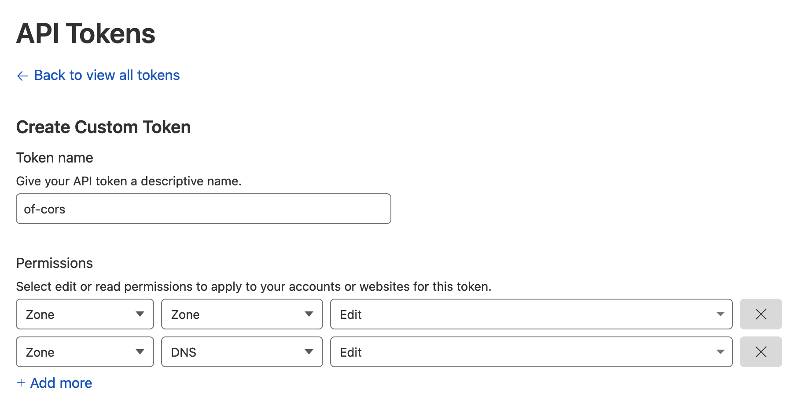
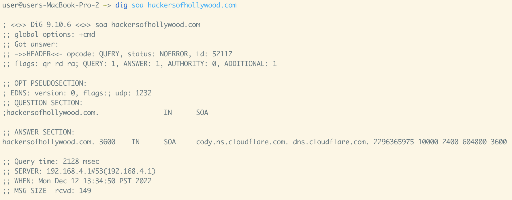
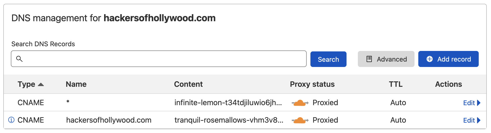
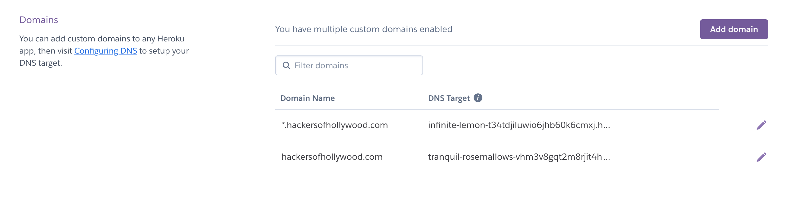
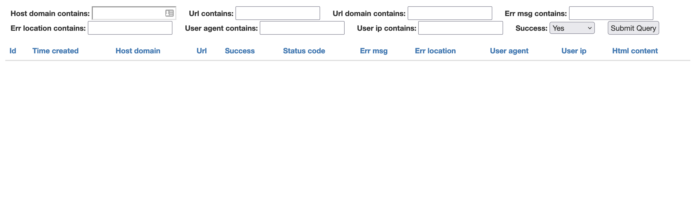
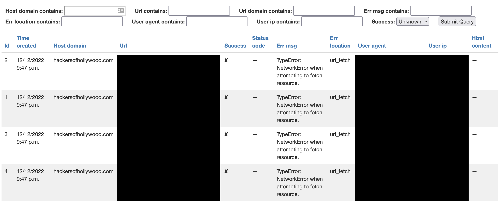

# of-CORS

`of-CORS` is [Truffle Security's](https://trufflesecurity.com/) tool suite for identifying and exploiting CORS misconfigurations on the internal networks of bug bounty targets using typosquatting.


You can read more here [https://trufflesecurity.com/blog/of-CORS](https://trufflesecurity.com/blog/of-CORS)

## How Does it Work??

`of-CORS` is a Python3 web application built on top of Django and Django Rest Framework. Once set up and configured `of-CORS` will automatically register browser service workers in the browsers of any victims that visit the application. These service workers send HTTP requests to a list of pre-configured internal domains with the intention of discovering CORS misconfigurations on internal networks. The results of these requests (whether successful or otherwise) are then submitted via API back to the `of-CORS` instance.

Once a service worker has been registered in a victim's browser, a JavaScript payload redirects the browser away to the page that `of-CORS` believes they were originally trying to access.

The collected results can subsequently be viewed in a minimalist dashboard available on the `of-CORS` application.

## Getting started

The following steps can be taken to set up `of-CORS` in your own deployment.

Due to the complexity of getting `of-CORS` set up (namely complications around SSL/TLS, DNS, and allowing wildcard requests to both) we make use of two cloud providers (Heroku and Cloudflare) in the application stack and Terraform to automate their configuration.

### Purchase Relevant Domains

Start by purchasing a domain an internal employee at the target company is likely to land on. We recommend buying a [typo-squat](https://www.kaspersky.com/resource-center/definitions/what-is-typosquatting) domain of an internal domain. We've found copypaste errors are a good place to start.

So for example if the company you're testing CORS uses uberinternal.com for internal domains, you may want to purchase berinternal.com to start getting browser traffic from internal employees.


### Get a Cloudflare API Key

`of-CORS` uses Cloudflare for receiving and routing wildcard DNS requests as well as terminating SSL/TLS connections.

You'll need an active [Cloudflare](https://www.cloudflare.com/) account to get DNS working correctly with `of-CORS`. Once you have a Cloudflare account you'll want to [create an API key](https://developers.cloudflare.com/fundamentals/api/get-started/create-token/) (which can be done [at the dashboard here](https://dash.cloudflare.com/profile/api-tokens)).

The API key will need to have sufficient privileges to add, delete, and configure zones as well as DNS records. This can be achieved by selecting the following permissions on the API token creation page:



Once you've created an API token with the correct permissions you can proceed to the next step.

*Important* make sure your cloudflare account is totally empty, and you don't register anything for the domain you purchased in the previous step

### Get a Heroku API Key

`of-CORS` uses Heroku for easy application deployment and hosting.

You'll need an active Heroku account to get the `of-CORS` application stack up and running. Once you have an account you'll want to add a credit card to your account (it will cost a few bucks a month all said and done)

### Configuring of-CORS for Deployment

With the API keys necessary for our infrastructure now set up and ready we can move on to configuring `of-CORS` for deployment. Take a look at the contents of the following example YAML configuration file which can be [found in the repository](files/example.yml):

```yaml
terraform:
  # You must change this to a unique string that is a valid Heroku app name
  heroku_app_name: best-of-cors
  # Fill this out with your Cloudflare API token
  cloudflare_api_token: this-is-my-api-token

hosts:
  # This can be an arbitrary string, but must be unique as a direct descendant of hosts
  testing:
    host_domain: 127.0.0.1:8080
    redirect_domain: google.com
    targets:
      - enable-cors.org
      - example.com
```

You'll need to create a new configuration YAML file of this format for deployment.

Under the `terraform` section you'll want to set `heroku_app_name` to a [Heroku-compliant app name](https://devcenter.heroku.com/articles/heroku-dev-center-style-guidelines#heroku-app-names) that is unique to your account. You'll also want to add your Cloudflare API key that you generated in the section above under the `cloudflare_api_token` directive.

The `hosts` section is where we define the domains that we expect `of-CORS` to receive traffic at and what to do when web visitors come along. Let's say that we have a company that we're targeting and we know that they have two internal domains (`myinternalcorp1.com` and `myinternalcorp2.com`). We went ahead and purchased the domain `yinternalcorp1.com` with the expectation that employees would accidentally visit it. In this case we would want to configure `hosts` as follows:

```yaml
hosts:
  testing_1:
    host_domain: yinternalcorp1.com
    redirect_domain: myinternalcorp1.com
    targets:
      - myinternalcorp1.com
      - myinternalcorp2.com
```

The `host_domain` here is the domain where you expect to receive traffic (ie: the domain that was purchased). `redirect_domain` defines the domain where victims should get redirected to once a payload is launched. `targets` specifies the domains that payloads should be launched against when a victim visits `of-CORS`.

Let's say that we also purchased `yinternalcorp2.com` and want to configure `of-CORS` to launch attacks when it's visited. The `hosts` section could then be updated like the following:

```yaml
hosts:
  testing_1:
    host_domain: yinternalcorp1.com
    redirect_domain: myinternalcorp1.com
    targets:
      - myinternalcorp1.com
      - myinternalcorp2.com
  testing_2:
    host_domain: yinternalcorp2.com
    redirect_domain: myinternalcorp2.com
    targets:
      - myinternalcorp1.com
      - myinternalcorp2.com
```

Now if a victim accidentally visits `yinternalcorp1.com` or `yinternalcorp2.com` the payloads for enumerating CORS misconfigurations on `myinternalcorp1.com` and `myinternalcorp2.com` would be launched and the victim's browser would subsequently be redirected to the correct domain.

### Deploying of-CORS

Run the following docker command, mounting the config file you just made into the container

```bash
docker run -v $PWD/config.yml:/config.yml -it --rm trufflesecurity/of-cors
```

This will prompt you to log into Heroku. You'll want to do so.

After logging into Heroku, this command can take 5-10 minutes so please be patient! It's enumerating subdomains with amass for your target domain.


**PLEASE NOTE** - There is a race condition that can occur when the Heroku infrastructure is spun up and and a console is immediately accessed within it. If you get an error please wait for a few minutes and try running `CONFIG_FILE=/config.yml make deploy_and_configure`.

After the `deploy_and_configure` command finishes running you will now have...

- DNS records configured in Cloudflare pointing to your Heroku application
- Heroku configured to receive traffic from all the relevant wildcard records
- `of-CORS` populated with candidate internal CORS misconfiguration domains

### Delegating DNS Authority

The last thing we need to do for the `of-CORS` deployment to be ready to receive traffic is to configure the domain names you purchased to use Cloudflare as their authoritative DNS servers. Cloudflare has an in-depth guide to [doing this here](https://developers.cloudflare.com/dns/zone-setups/full-setup/setup/).


## Viewing Results

The following command can be used to view and query all the results in an authenticated browser session:

```bash
CONFIG_FILE=/config.yml make open_heroku_console
```

## Adding and Removing Targets

The `of-CORS` configuration file is intended to support flexible addition and removal of domains that attacks are launched for. Simply update the contents of the `hosts` section in your configuration file and re-run the provisioning script:

```bash
source venv/bin/activate
CONFIG_FILE=/tmp/of_cors_config.yml make deploy_and_configure
```


### Confirming Everything is Set Up Correctly

Go through the following steps to confirm that your software is up and running correctly. For the purpose of this section we will use an instance of `of-CORS` that was set up under the domain `hackersofhollywood.com`.

First let's check that our domain's SOA records point to Cloudflare:

```bash
dig soa <domain>
```

As shown below the SOA records for `hackersofhollywood.com` correctly point to the Cloudflare nameservers:



We then review the Cloudflare account to confirm that DNS records have been set up for both `hackersofhollywood.com` and `*.hackersofhollywood.com` with CNAME contents pointing to Heroku domains. This is done through the Cloudflare web UI under the DNS section:



The next step is to confirm that Heroku is configured to receive traffic via these two CNAME records. This can be done through the Heroku web UI under `Settings` -> `Domains`:



Sure enough we see two domain names with the appropriate DNS targets configured in Heroku and these targets are correctly reflected in Cloudflare's CNAME records.

We can then run the following command to open an authenticated browser session to the results viewer page of `of-CORS`:

```bash
CONFIG_FILE=<path_to_config_file> make open_heroku_console
```

This should bring up an empty dashboard in your browser:



Lastly we can test that CORS misconfiguration probing is launching successfully. Open up a browser to the base domain for one of your configurations (in our example, https://hackersofhollywood.com) and confirm that the page redirects after a few seconds:


Now navigate back to the dashboard page and change the `Success` filter to filter for `Unknown` and hit the `Submit Query` button. You should now see a bunch of results populated:



Your trap is set! Now just sit back and relax and wait for your victims to stumble upon your tasty little domain.
